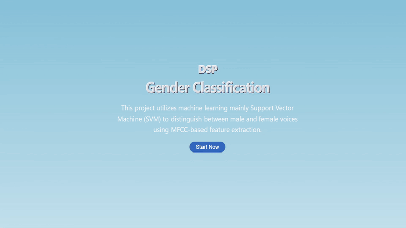

# Audio gender classification app
> An app for gender classification that utilizes machine learning mainly Support Vector Machine (SVM) to distinguish between male and female voices using MFCC-based feature extraction. 

## Description
A simple audio classification model that identifies the speaker's gender by primarily extracting Mel-frequency cepstral coefficients (MFCC) features. It uses traditional machine learning algorithms Support Vector Machines (SVM). A simple interface was created to test the model.

## Interface

## Features

- Fast audio classification.
- Accurate gender detection of speaker.
- Simple interface to allow users to test the model.

## Getting Started
- you must install ffmpeg first before running the project for audio processing here is a link on how to install https://phoenixnap.com/kb/ffmpeg-windows
- ### Server Setup
1. Clone the repository to your local machine:
    `git clone https://github.com/mohammedshady/audio-gender-classification.git`
2. Navigate to the repo directory:
    `cd audio-gender-classification`
3. Install the required dependencies in the requriements.txt:
    `pip install -r requirements.txt`
6. Start the Flask server:
    `python server.py`

- ### Interface Setup
1. Navigate to the client directory:
    `cd front-end`
2. Install the required dependencies:
    `npm install`
3. Start the React development server:
    `npm run dev`
4. Access the application in your web browser at `http://localhost:5173`.

## Authors
- **Mohammed Shady** - _GitHub Profile_: [mohammedshady](https://github.com/mohammedshady) | _Email_: mohatech777@gmail.com

If you encounter any issues or have suggestions for improvements, please reach out via email. Your feedback is valuable and helps us enhance the app for everyone.

